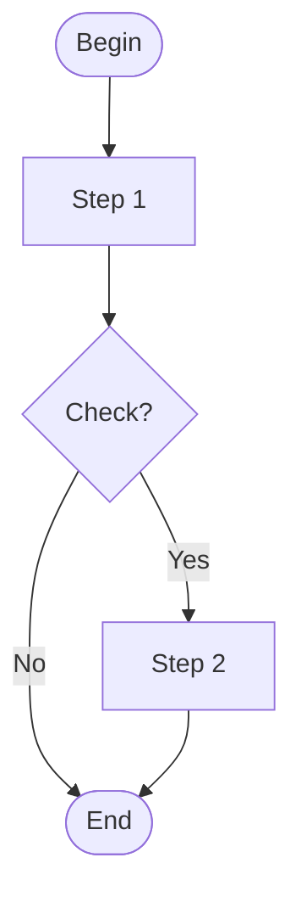

# Mermaid Flowchart to draw.io XML Converter

Convert Mermaid flowchart files to draw.io XML format for visualization.

## 🎯 What it does

Mermaid flowchart (text-based diagram) → draw.io XML → Beautiful editable diagrams

## 🚀 Quick Start

```bash
# Install
pip install networkx

# Convert OTS file to draw.io XML
python mermaid_to_drawio.py OTS -o output/flowchart.xml

# Import to draw.io
# 1. Open https://app.diagrams.net
# 2. File → Open from → Device
# 3. Select flowchart.xml
# 4. Arrange → Layout → Vertical Flow
```

## 📖 Input Format

Your Mermaid file should use flowchart syntax:



Supported shapes:
- `[]` → 🟦 Rectangle (card)
- `()` → 🟨 Rounded (sticky_note)
- `{}` → 🟩 Diamond (shape)

## 📝 Example: OTS File

The included `OTS` file is a 649-line Mermaid flowchart for an exam management system with:
- 200+ nodes (process steps)
- 300+ edges (transitions)
- Multiple decision points and workflows

Convert it:
```bash
python mermaid_to_drawio.py OTS
# Output: output/flowchart.xml
```

## 🎨 Import to draw.io

1. **Open draw.io**: https://app.diagrams.net
2. **Import XML**:
   - File → Open from → Device
   - Select the generated `.xml` file
3. **Auto-arrange** (recommended):
   - Select All (Ctrl+A)
   - Arrange → Layout → Vertical/Horizontal Flow
4. **Edit & Export**:
   - Change colors, resize nodes
   - Export to PNG/PDF/SVG

## 🛠️ Code Structure

```
.
├── mermaid_to_drawio.py       # Main converter script
├── OTS                        # Example: Mermaid flowchart
├── src/
│   ├── mermaid_parser.py      # Parse Mermaid syntax
│   ├── graph_converter.py     # Convert to NetworkX graph
│   └── drawio_exporter.py     # Export to draw.io XML
└── output/
    └── flowchart.xml          # Generated XML
```

## ⚙️ How it works

```
Mermaid File (OTS)
   ↓
Parse nodes & edges (MermaidParser)
   ↓
Build NetworkX graph (GraphConverter)
   ↓
Generate draw.io XML (DrawIOExporter)
   ↓
XML Output
```

## 🔧 Advanced Usage

### Custom input/output

```bash
# Convert any Mermaid file
python mermaid_to_drawio.py my_diagram.mmd -o my_output.xml
```

### Python API

```python
from src import MermaidParser, GraphConverter, DrawIOExporter

# Parse Mermaid file
parser = MermaidParser()
graph_data = parser.parse_file('OTS')

# Build graph
converter = GraphConverter(directed=True)
# ... (convert nodes/edges)
graph = converter.convert(nodes, edges)

# Export
exporter = DrawIOExporter(graph)
exporter.save_to_file('output.xml')
```

## 🎨 draw.io Features

Generated XML includes:
- ✅ Color-coded nodes by shape type
- ✅ Edge labels from Mermaid
- ✅ Orthogonal connectors
- ✅ Proper node sizing
- ✅ Compatible with draw.io online & desktop

## 🐛 Troubleshooting

### Parser errors

If parsing fails, check:
- Mermaid syntax is valid
- All nodes are defined before use
- Edge syntax uses `-->`

### Import issues

- Try different browser (Chrome recommended)
- Use draw.io desktop app
- Check XML is valid: `cat output.xml`

### Layout issues

- Use draw.io's auto-layout: Arrange → Layout
- Manually adjust node positions
- Try different layout algorithms

## 📦 Requirements

- Python 3.8+
- networkx (for graph operations)

```bash
pip install networkx
```

## 📚 Documentation

- **[README.md](README.md)** - This file
- **[DRAWIO_GUIDE.md](DRAWIO_GUIDE.md)** - Complete draw.io usage guide

## 🤝 Contributing

Feel free to submit issues or pull requests.
